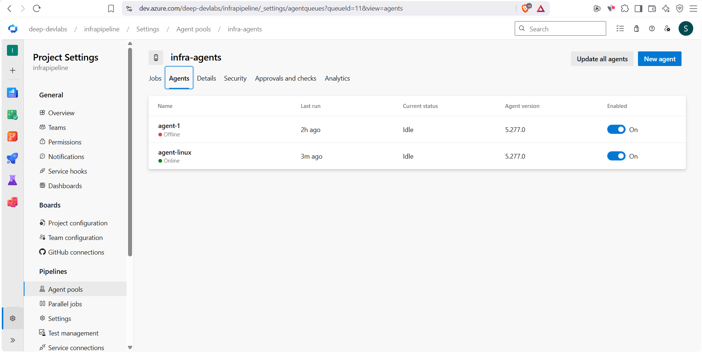
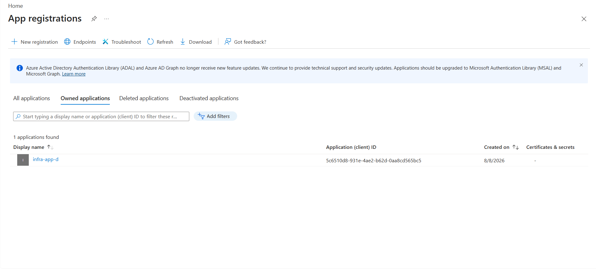
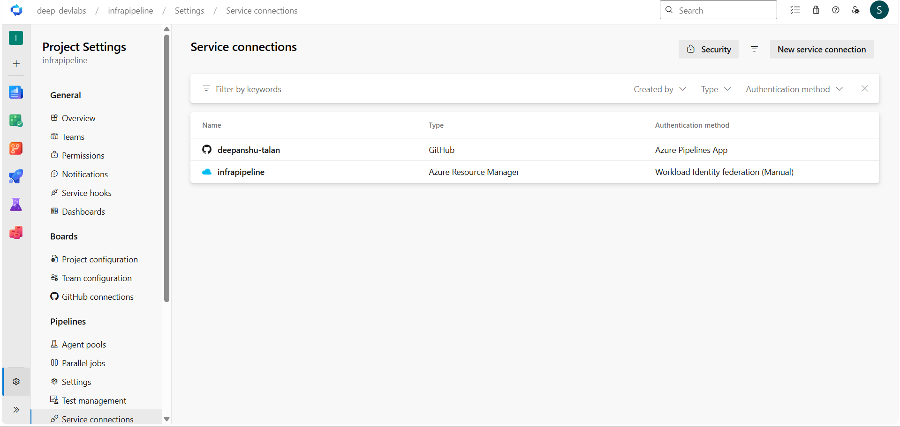
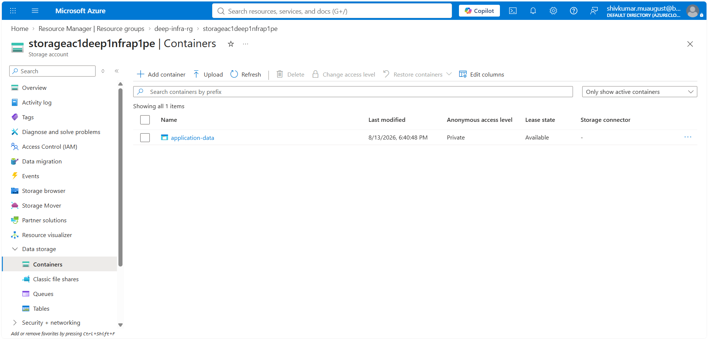
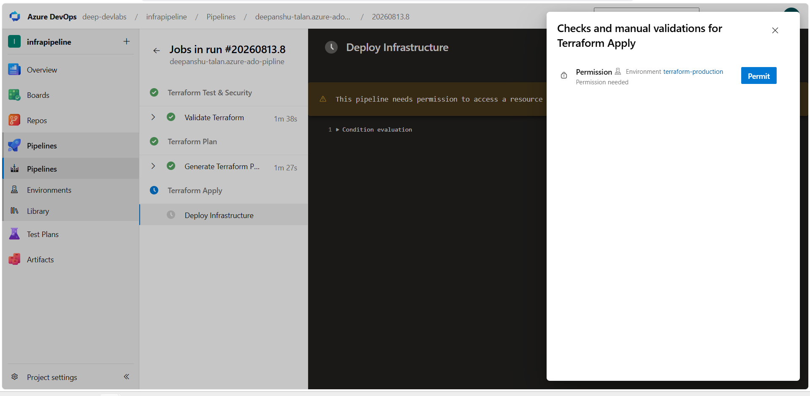
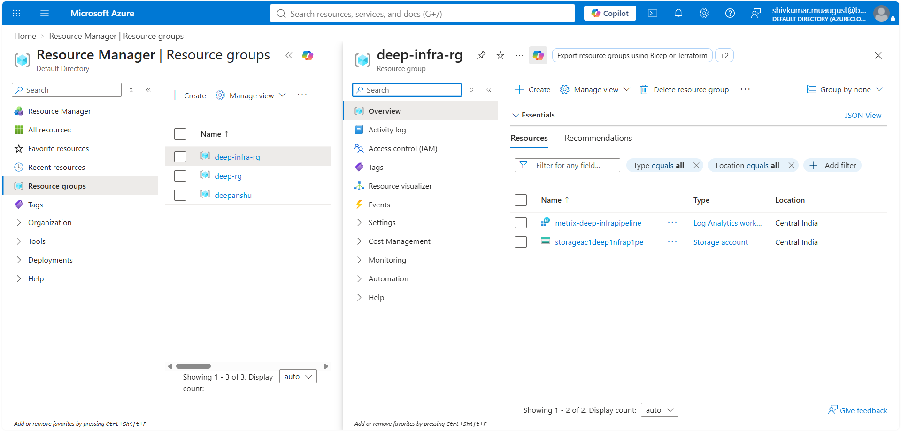

# 🚀 Infrapipeline

### Terraform + Azure DevOps Infrastructure Automation

Infrapipeline is an Infrastructure as Code (IaC) project that uses **Terraform** to provision Azure resources and **Azure DevOps** to automate the infrastructure deployment process.

The project uses a **self-hosted Linux agent** to execute the Terraform pipeline and an **Azure Storage Account** for remote Terraform state.

---

## 📌 Overview

The project demonstrates an automated Terraform workflow covering:

- Infrastructure provisioning with Terraform
- Azure resource management
- Terraform remote state management
- Azure DevOps CI/CD
- Self-hosted Linux build agent
- Terraform formatting and validation
- Terraform linting with TFLint
- Infrastructure security scanning
- Terraform plan generation
- Automated Terraform apply
- Azure authentication through an Azure DevOps service connection

The overall workflow is:

```bash
Write Infrastructure
        │
        ▼
     Validate
        │
        ▼
       Scan
        │
        ▼
       Plan
        │
        ▼
      Deploy
```

---

# 🏗️ Architecture

```bash
                         ┌──────────────┐
                         │    GitHub    │
                         └──────┬───────┘
                                │
                                ▼
                     ┌──────────────────────┐
                     │     Azure DevOps     │
                     │       Pipeline       │
                     └──────────┬───────────┘
                                │
                                ▼
                   ┌──────────────────────────┐
                   │  Self-Hosted Linux Agent │
                   └────────────┬─────────────┘
                                │
                                ▼
                       ┌─────────────────┐
                       │ Terraform Test  │
                       └────────┬────────┘
                                │
               ┌────────────────┼────────────────┐
               │                │                │
               ▼                ▼                ▼
         ┌──────────┐     ┌──────────┐    ┌─────────────┐
         │  Format  │     │  TFLint  │    │   Security  │
         │  Check   │     └────┬─────┘    │    Scan     │
         └────┬─────┘          │          └──────┬──────┘
              │                │                 │
              └────────────────┼─────────────────┘
                               │
                               ▼
                      ┌─────────────────┐
                      │ Terraform Plan  │
                      └────────┬────────┘
                               │
                               ▼
                      ┌─────────────────┐
                      │ Terraform Apply │
                      └────────┬────────┘
                               │
                               ▼
                      ┌─────────────────┐
                      │ Microsoft Azure │
                      └────────┬────────┘
                               │
               ┌───────────────┼────────────────┐
               │               │                │
               ▼               ▼                ▼
        Resource Group  Storage Account  Log Analytics
                               │
                               ▼
                         Blob Container
```

---

# ☁️ Azure Infrastructure

The Terraform configuration provisions the following Azure resources:

| Resource | Purpose |
|---|---|
| **Resource Group** | Contains the Azure resources |
| **Storage Account** | Provides Azure Storage and Terraform state storage |
| **Blob Container** | Stores Terraform remote state |
| **Log Analytics Workspace** | Provides a foundation for monitoring and logging |

All infrastructure is defined using Terraform configuration files.

---

# 🔄 CI/CD Pipeline

The Azure DevOps pipeline follows a simple Terraform workflow:

```bash
        Code Push
            │
            ▼
    Terraform Initialization
            │
            ▼
    Terraform Format Check
            │
            ▼
    Terraform Validate
            │
            ▼
          TFLint
            │
            ▼
      Security Scan
            │
            ▼
      Terraform Plan
            │
            ▼
      Terraform Apply
            │
            ▼
      Azure Resources
```

## Test

The test stage performs checks before infrastructure deployment.

The stage includes:

```bash
terraform fmt -check -recursive
terraform validate
tflint
```

A Terraform security scan is also performed to identify potential infrastructure security issues.

## Plan

The plan stage initializes Terraform with the Azure remote backend and generates the Terraform execution plan.

Terraform reads the current remote state before determining the required infrastructure changes.

## Apply

The apply stage deploys the infrastructure defined in the Terraform configuration to Microsoft Azure.

---

# 🖥️ Self-Hosted Linux Agent

The Azure DevOps pipeline runs using a **self-hosted Linux agent** rather than a Microsoft-hosted agent.

The agent is registered with an Azure DevOps agent pool and executes the Terraform pipeline tasks.

The self-hosted agent is responsible for running tools such as:

- Terraform
- TFLint
- Security scanning tools
- Git
- Other pipeline dependencies

### Agent Pool



---

# 🔐 Azure Authentication

Azure authentication is handled through an **Azure DevOps Service Connection**.

An **Azure App Registration** is used as part of the authentication setup.

Credentials and authentication details are not stored directly inside the Terraform configuration.

### Azure App Registration



### Azure DevOps Service Connection



---

# 🗄️ Terraform Remote State

Terraform state is stored remotely using an Azure Storage Account.

The state storage structure is:

```bash
Azure Storage Account
        │
        ▼
   Blob Container
        │
        ▼
 terraform.tfstate
```

Using remote state allows the Terraform pipeline to work with a shared state instead of relying on a local state file on the build machine.

### Storage Container



---

# 🔑 Azure DevOps Permissions

During the initial pipeline setup, Azure DevOps required permission for the pipeline to use the configured Azure service connection.

After the required permission was granted, the pipeline was able to authenticate with Azure and execute Terraform operations.



---

# 📦 Infrastructure Deployment

Terraform creates the required Azure infrastructure from the configuration defined in the repository.

The deployed resources include:

- Resource Group
- Storage Account
- Blob Container
- Log Analytics Workspace

### Azure Resources



---

# ✅ Successful Pipeline Execution

The completed pipeline successfully runs the Terraform workflow using the self-hosted Linux agent.


The complete deployment flow is:

```bash
            Terraform Code
                  │
                  ▼
               GitHub
                  │
                  ▼
            Azure DevOps
                  │
                  ▼
        Self-Hosted Linux Agent
                  │
                  ▼
        Terraform Validation
                  │
                  ▼
        Linting & Security Checks
                  │
                  ▼
           Terraform Plan
                  │
                  ▼
           Terraform Apply
                  │
                  ▼
         Azure Infrastructure
```

---

# 🛠️ Technologies Used

| Technology | Usage |
|---|---|
| **Terraform** | Infrastructure as Code |
| **Microsoft Azure** | Cloud infrastructure |
| **Azure DevOps** | CI/CD pipeline |
| **GitHub** | Source control |
| **Linux** | Self-hosted build agent |
| **TFLint** | Terraform linting |
| **Security Scanner** | Terraform security analysis |
| **Azure Storage** | Terraform remote state |
| **Log Analytics** | Monitoring and logging |

---

# 📁 Repository Structure

```text
infrapipeline/
│
├── docs/
│   └── screenshots/
├── main.tf
├── variables.tf
├── outputs.tf
├── versions.tf
├── .tflint.hcl
├── .gitignore
├── .terraform.lock.hcl
├── azure-pipelines.yml
└── README.md
```

---

# 🎯 Key Implementation Areas

## Infrastructure as Code

Terraform is used to define and provision Azure infrastructure through declarative configuration.

## Remote State

Terraform state is stored in Azure Storage instead of being maintained only on the local machine.

## CI/CD Automation

Azure DevOps automates the Terraform workflow from validation through deployment.

## Self-Hosted Agent

The pipeline executes on a Linux self-hosted agent configured in Azure DevOps.

## Terraform Validation

Terraform formatting and validation are performed before deployment.

## Terraform Linting

TFLint checks the Terraform configuration against recommended Terraform practices.

## Security Scanning

Terraform configuration is scanned for potential security issues before deployment.

## Azure Authentication

Azure DevOps connects to Azure through a configured service connection backed by an Azure App Registration.

---

# 📚 Learning Outcomes

This project provides practical experience with:

- Terraform project structure
- Terraform providers
- Terraform resources
- Terraform variables
- Terraform outputs
- Terraform state management
- Azure Storage remote backend
- Azure DevOps pipelines
- Self-hosted Linux agents
- Azure DevOps agent pools
- Azure service connections
- Azure App Registration
- Terraform validation
- Terraform formatting
- TFLint
- Infrastructure security scanning
- Terraform plan and apply
- Automated Azure infrastructure deployment

---

# 🚀 Future Improvements

Possible future improvements include:

- Terraform modules for reusable infrastructure
- Separate Development and Production environments
- Pull Request based Terraform validation
- Terraform plan artifacts
- Azure Key Vault integration
- Improved monitoring and alerting
- Environment-specific configurations
- Production deployment approvals
- Additional Azure resources
- More advanced CI/CD controls

---

# 📌 Summary

Infrapipeline combines Terraform and Azure DevOps to automate Azure infrastructure deployment.

The implementation demonstrates the complete Infrastructure as Code workflow:

```bash
        Infrastructure as Code
                │
                ▼
           Version Control
                │
                ▼
           CI/CD Pipeline
                │
                ▼
           Self-Hosted Agent
                │
                ▼
         Validation & Security
                │
                ▼
              Plan
                │
                ▼
              Apply
                │
                ▼
         Azure Infrastructure
```

The result is a repeatable Terraform deployment process with remote state, automated validation, linting, security checks, and Azure infrastructure provisioning.